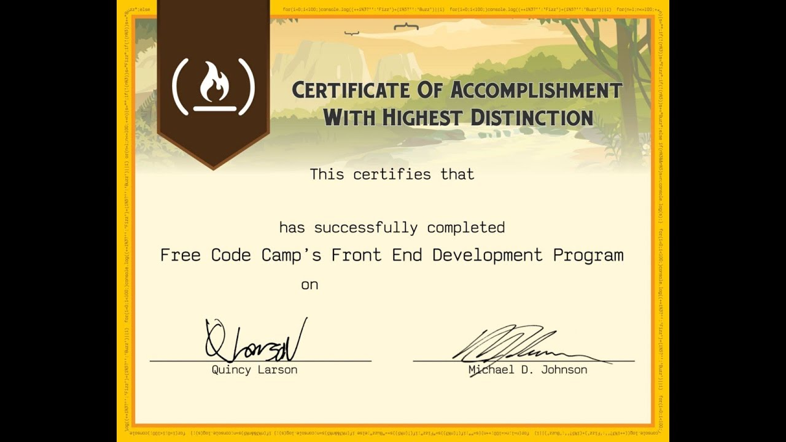

# Alexander Twin

### Junior Frontend Developer

* Контактная информация:
  - Phone: +79490050505
  - E-mail: 4xp6t48@gmail.com
  - Telegram: @nonameXemanon

Junior Frontend Developer with basic knowledge of HTML, CSS, JavaScript. Seeking first job to apply skills and grow in web development.

**Skills:**

Languages & Technologies: HTML5, CSS3 (Flexbox, Grid), JavaScript (ES6+), React (basic level)
Tools: Git, Figma (for prototypes), VS Code
Other: Responsive design, basic SCSS, API (fetch/Axios), adaptive layout
Languages: Russian (native), English (B1 - Intermediate)

**Work Experience:**

Freelance / Pet Projects
Junior Frontend Developer (independent projects)
Minsk | January 2025 – Present

Created a landing page for a local cafe with responsive design using HTML, CSS, and JavaScript. Used Grid and Flexbox for mobile version.
Developed a simple ToDo app in React with local storage (localStorage). Added add/delete task functionality.
Built a multi-page portfolio site with CSS animations and interactive JS elements.

**Education:**

Bachelor's in Computer Science
Belarusian State University (BSU), Minsk
2022 – 2026 (expected graduation)

> "Web Development" course, studied frontend basics.

**Projects:**

ToDo App (React, 2026): Task management application. 
Cafe Landing (HTML/CSS/JS, 2025): Responsive site with contact form. 
Weather Widget (API) (JS, 2025): Widget with weather data via OpenWeatherMap.

**Certificates:**

freeCodeCamp: Responsive Web Design (2025)
[Udemy](https:www.udemy.com): "The Complete JavaScript Course" (2026)
This is a basic CV template for a junior frontend developer. Replace details with real ones, add live project links, and tailor to the job (keywords like React/Vue).
 
